# Configure Github Pipeline for Azure

## Pre-requisities:

* Installed [azcli](https://learn.microsoft.com/en-us/cli/azure/install-azure-cli) and `jq`
* Authenticated `azcli`
* Set the subscription to the targeted subscription for deployment with azcli
    * `az account set --subscription <mysubscription>`

## Process

1. Create a Wiz service account with the ability to `create:security_scans` (use existing one if you have one)
   * Record secret and key for future use
2. <b>From your Github account</b> create a private Github repo
   * Make it private
   * Import using the `Code` button on the public repo to VS Code
3. Clone the repo locally
   * Open a terminal in VS Code inside the cloned repo
4. Check that you have an ssh public key `cat ~/.ssh/id_rsa.pub` 
    * If there is no file then run `ssh-keygen` to generate one 
5. Create SPN and application for Azure using the script `spn_bucket_create.sh`
    * Be sure you have authenticated with `az login`
    * Run `sed -i -e 's/\r$//' spn_bucket_create.sh` if you have issue with the interpreter
    * chmod +x if required
    * Record the json output and the subscription
6. Create a new branch in the local repo `git branch azure_pipelines_test_1`
7. Switch to the new branch `git checkout azure_pipelines_test_1`
8. 6. (optional) Run `curl ifconfig.me` and record your ip 
    * (optional) Overwrite the `my_ip` variable in `demo.tfvars` 
9. Overwrite the `subscription_id` variable in the `backend.tf` file 
10. Add the `subscription_id="<yoursub_id>"` to the `azurerm` provider in the `providers.tf` file
11. Add the creds to Github repo actions secrets including the ssh public key
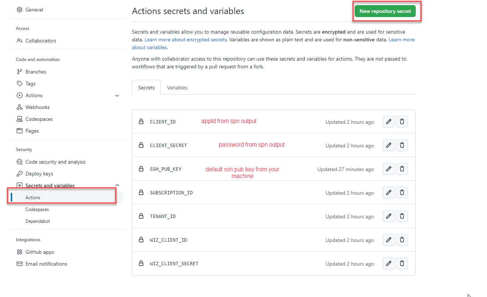
12. Push the repo to git hub
13. Add branch protection

# Jenkins Demo Setup

## Process

1. Record the public ip frm the pipeline output 
    * If there is no output then run re-run the pipeline 
    * NOTE: THIS SEEMS TO BE REQUIRED CURRENTLY 

2. Log into the instance with `ssh azureuser@<public_ip_address_here>` 
    * NOTE: If you recieve access denied.. Go get coffee and try again :-)

3. run `sudo tail -f /var/log/cloud-init-output.log` 

. Stretch 

5. Once the log finishes record the GUID for the Jenkins admin initial password 
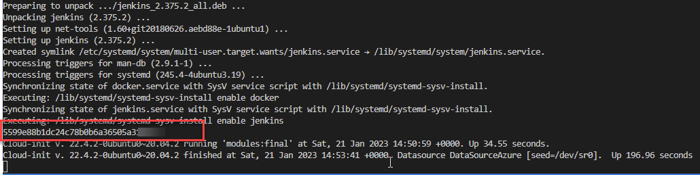 

6. Go to `http://<public_ip_address_here>:8080` 

7. Unlock Jenkins with GUID 
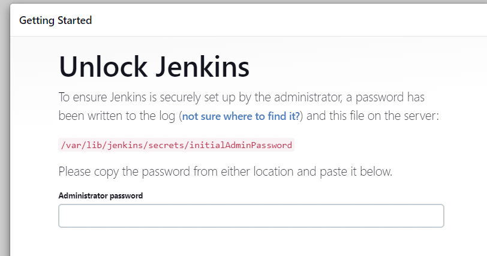 

8. Install suggested plugins 
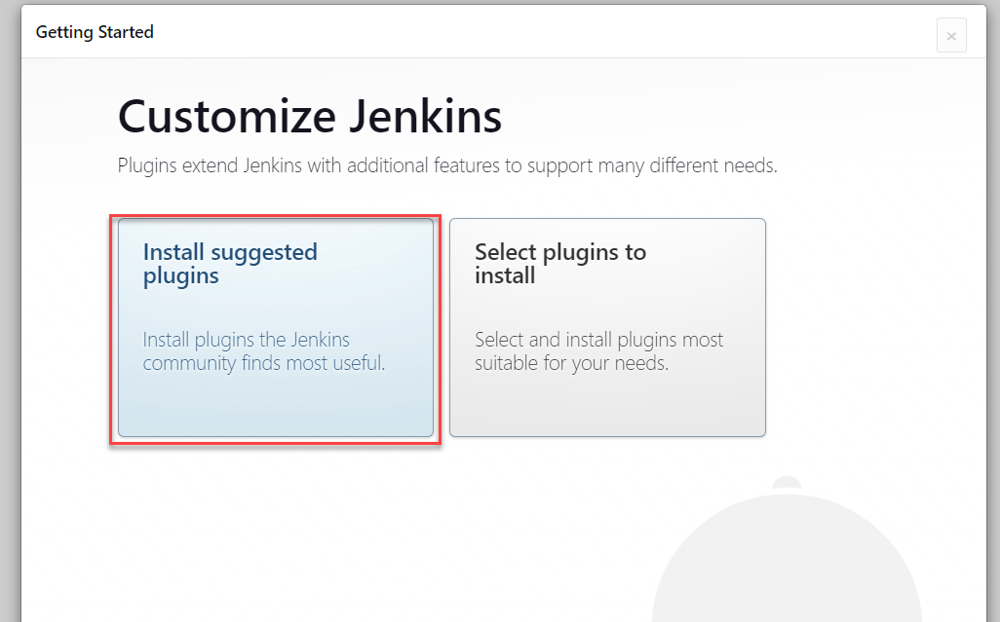 

9. Get coffee 

10. Skip user creation and continue as admin 

11. Select `Not now` for instance configuration 

12. Start using Jenkins 
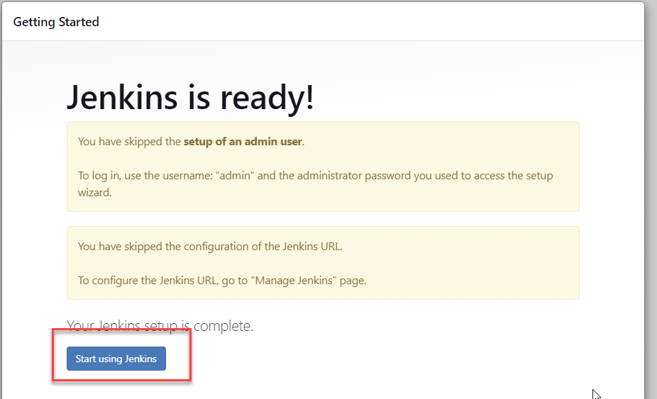 

13. Restart jenkins from the instance `sudo systemctl restart jenkins` 

1. Log back into Jenkins with admin and the initial password

15. Add the credentials to Jenkins 
    a. Manage Jenkins 
    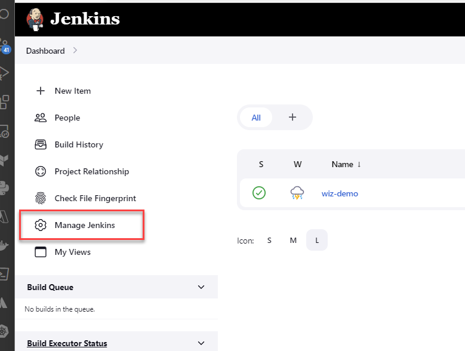 
    b. Manage Credentials 
    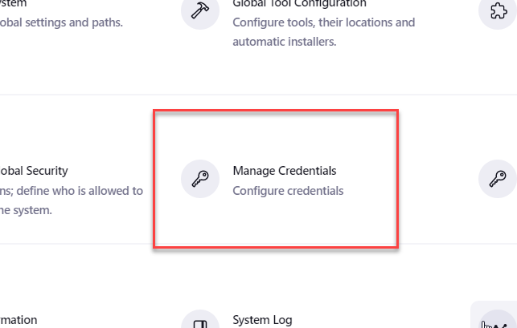 
    c. System 
    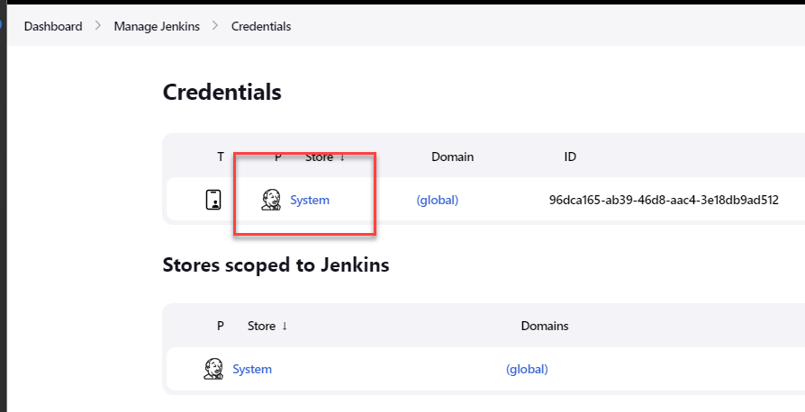 
    d. Global Credentials 
    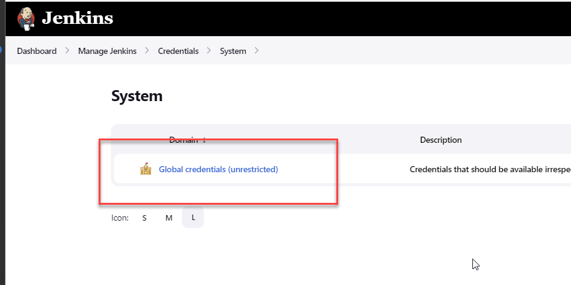 
    e. Add Credentials 
    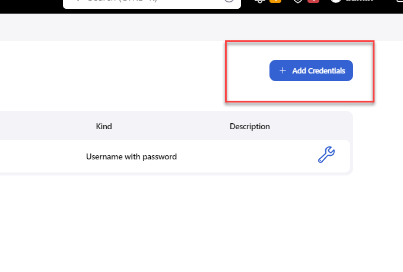 
    f. Add `username and password` credentials as shown below. 
        * NOTE: Be sure to give them the id of `wiz-cli` 
    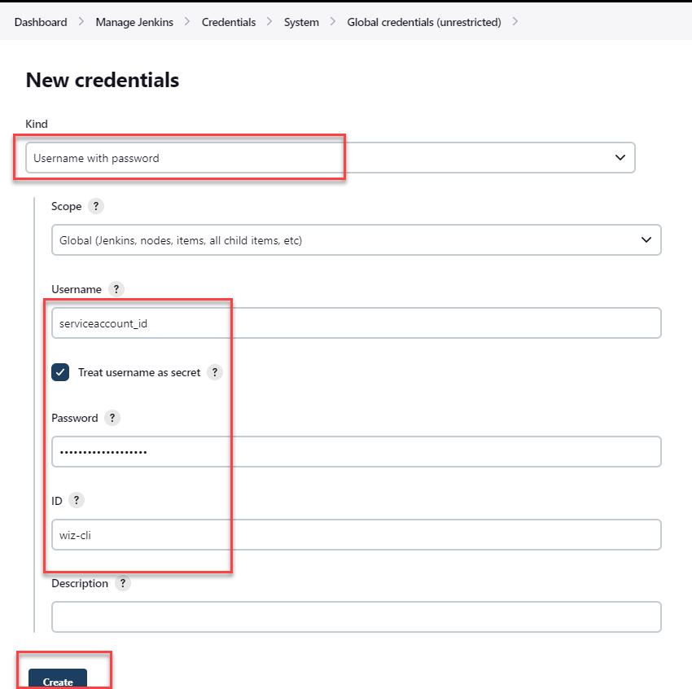 

16. Go back to the Jenkins Dashboard 

17. New Item 
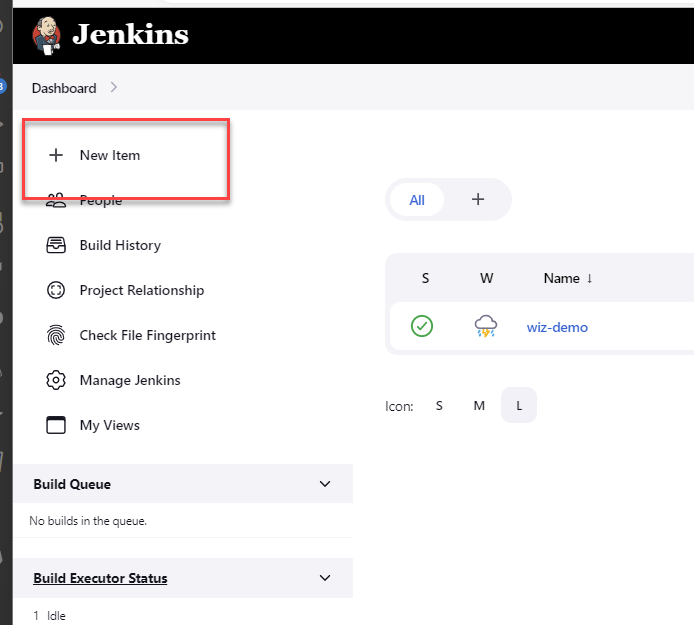 

18. Add pipeline project with name `wiz-demo-pipeline` 
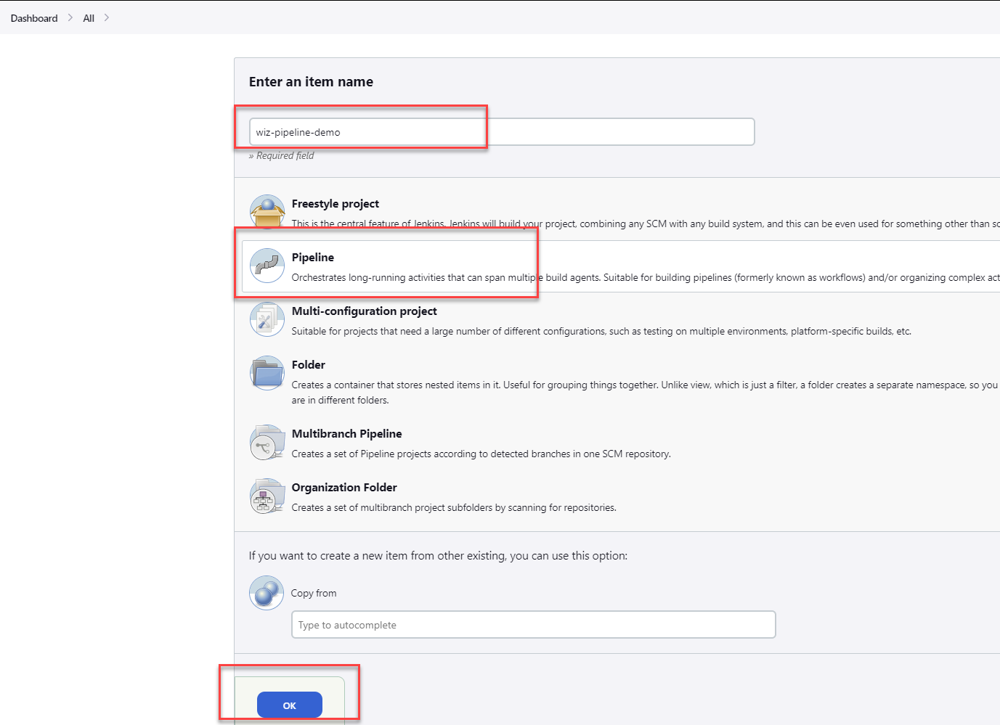 

19. Add the pipeline file data [jenkins_pipeline](./jenkins_pipeline) to the pipeline steps 

20. Run the pipeline 
    * If you recieve `Got permission denied while trying to connect to the Docker daemon socket` restart jenkins as shown above

21. Review output 

22. Add Wiz CICD Policies to the pipeline scans to make the pipeline fail for vulns.. then iac 

23. Extra credit.. Figure out how to run pipeline steps on previous step failre (step conditons)
